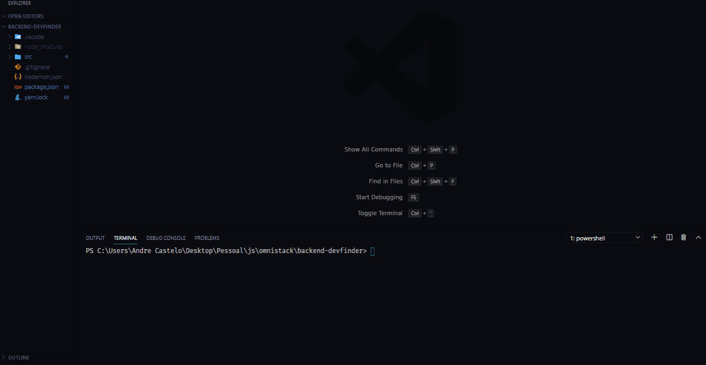

## Backend web Smart DevFinder
<p align="center">
<strong>Node js backend application for support the DevFinder, the backend of the application support managing geolocation and registration through the github API </strong>
</p>
<p align="center">
  
  <a aria-label="Node Version" href="https://github.com/nodejs/node/blob/master/doc/changelogs/CHANGELOG_V12.md#12.14.1">
    </img>
  </a>

</p>

To init the backend aplication in React, do the follow lines:
```bash
cd backend-devfinder
yarn install
yarn dev
```
After this, the server will be load at the `localhost:3333`
  


